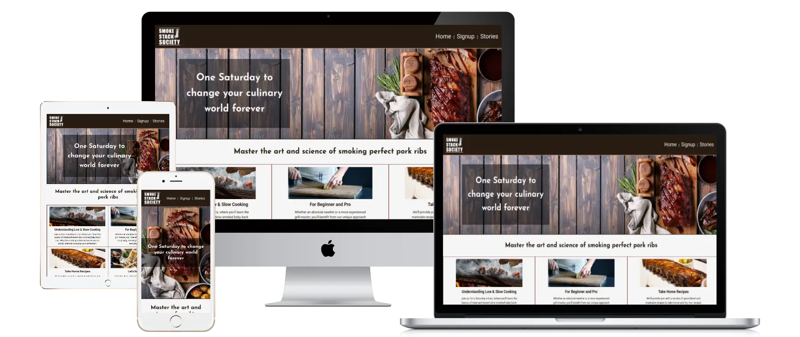
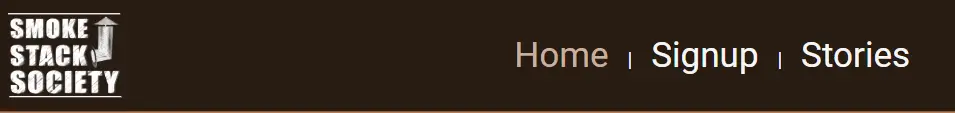
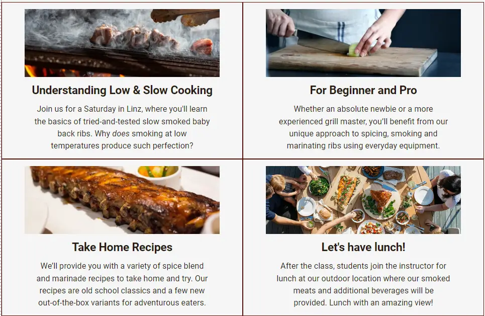
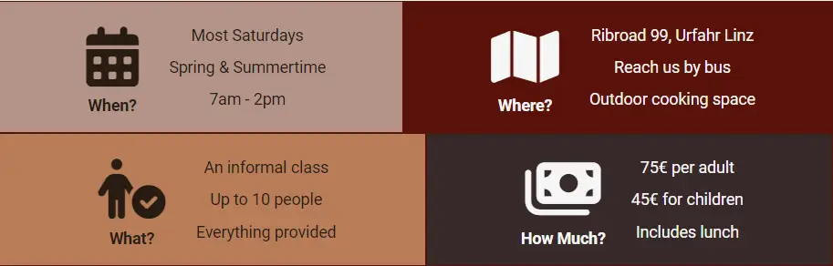
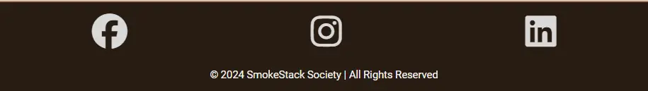
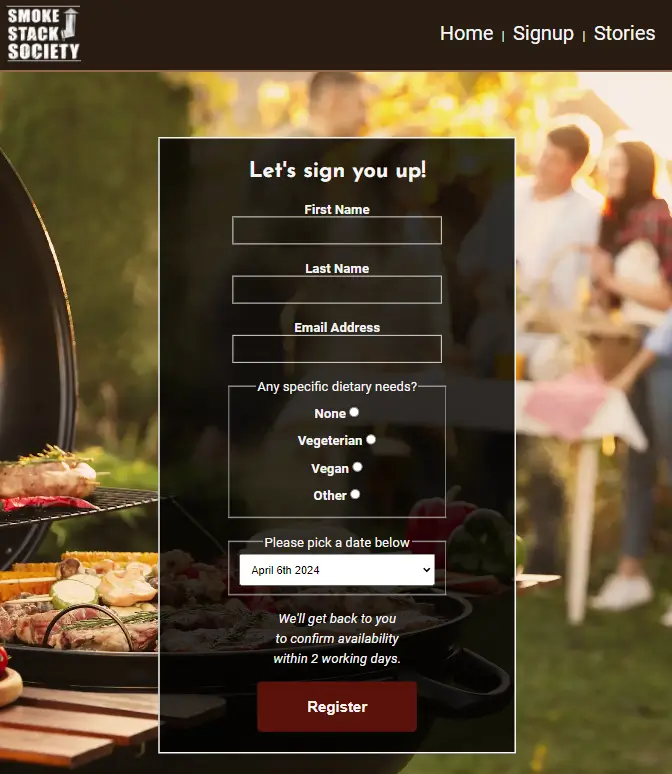

# SmokeStack Society

Welcome to the Readme file for SmokeStack Society.

## Table of Contents

- [Overview](#overview)
- [Screenshots](#screenshots)
- [Features](#features)
  - [Existing Features](#existing-features)
    - [Site Logo](#site-logo)
    - [Header and Navigation Bar](#header-and-navigation-bar)
    - [Hero Section](#hero-section)
    - [Motivational Boxes](#motivational-boxes)
    - [Information Boxes](#information-boxes)
    - [Footer](#footer)
    - [Sign Up Page](#sign-up-page)
    - [Customer Testimonials](#customer-testimonials)
  - [Future Ideas](#future-ideas)
- [Testing](#testing)
  - [Validator Testing](#validator-testing)
  - [Accessibility Testing](#accessibility-testing)
  - [Bugs](#bugs)
      - [Fixed](#fixed)
      - [Unfixed](#unfixed)
- [Deployment](#deployment)
  - [Links](#links)
- [Credits](#credits)
  - [Content](#content)
  - [Media](#media)

## Overview

## Screenshots

## Features

Xx

### Existing Features

Xx

#### Header and Navigation Bar

#### Header and Navigation Bar

#### Hero Section

Xx

#### Motivational Boxes

Xx

#### Information Boxes

#### Footer

#### Sign Up Page

#### Customer Testimonials

### Future Ideas

Xx

## Testing

Xx

### Validator Testing

Xx

### Accessibility Testing

Xx

### Bugs

`code`

#### Fixed

Xx

#### Unfixed

Xx

## Deployment

Xx

### Links

Xx

## Credits

Xx

### Content

Xx

### Media

Xx

