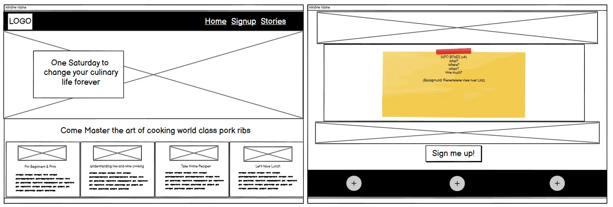
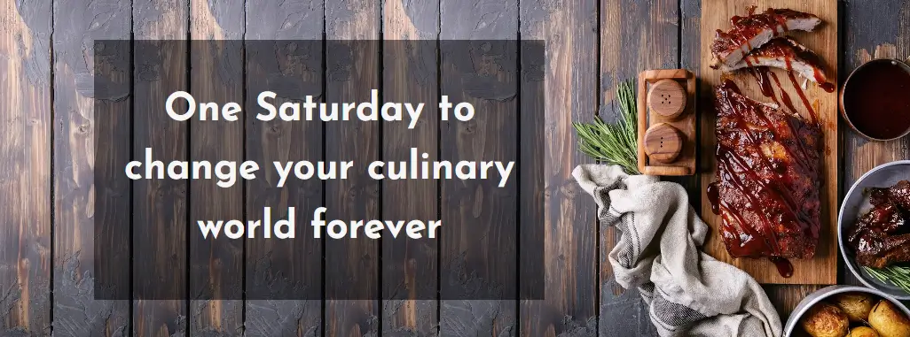
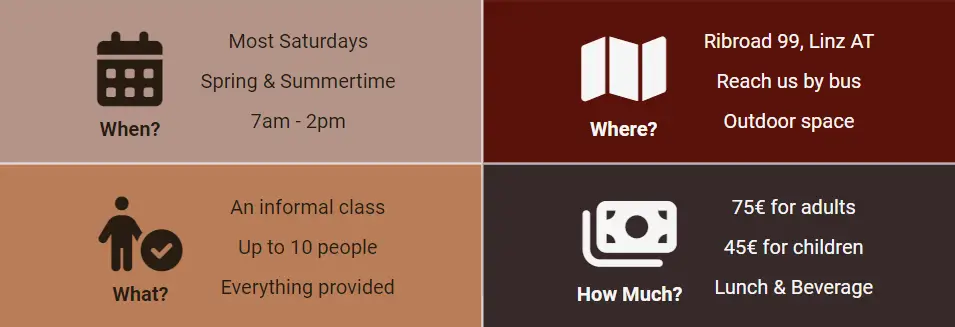

# SmokeStack Society

Welcome to the Readme file for the business website of **SmokeStack Society**, based in Linz, Austria.

**Link to Live Site: https://leonp84.github.io/code-institute-project-1/**
 
 

## Table of Contents

- [Overview](#overview)
- [UX](#ux)
  - [User Stories](#user-stories)
    - [User](#user)
    - [Business Owner](#business-owner)
  - [Site Concept](#site-concept)
  - [Wireframing](#wireframing)
    - [Desktop](#desktop)
    - [Mobile](#mobile)
  - [Site Design](#site-design)
- [Features](#features)
  - [Existing Features](#existing-features)
    - [Site Logo](#site-logo)
    - [Header and Navigation Bar](#header-and-navigation-bar)
    - [Hero Section](#hero-section)
    - [Motivational Boxes](#motivational-boxes)
    - [Information Boxes](#information-boxes)
    - [Parallax Image](#parallax-image)
    - [Customer Testimonials Link](#customer-testimonials-link)
    - [Footer](#footer)
    - [Sign Up Page](#sign-up-page)
    - [Customer Testimonials](#customer-testimonials)
  - [Future Ideas](#future-ideas)
- [Testing](#testing)
  - [Manual Testing](#manual-testing)
  - [Validator Testing](#validator-testing)
  - [Lighthouse Testing](#lighthouse-testing)
  - [Accessibility Testing](#accessibility-testing)
  - [Bugs](#bugs)
- [Deployment](#deployment)
  - [Links](#links)
- [Credits](#credits)
  - [Content](#content)
  - [Media](#media)

## Overview

SmokeStack Society is the business website of a (fictional) for-profit cooking class hosted in Linz, Austria. The site is designed with prospective customers in mind, with the primary purpose of convincing visitors to **sign up for a cooking class**. The entire site funnels visitors towards the sign-up page and the various layouts were designed, and content written, to motivate visitors to sign up.

The site is responsive across all screen sizes, the primary break point for layout adjustment is 768px. The site looks most visually appealing in cell phone and tablet (portrait) format.

## UX

### User Stories

The sentences below outline possible motivations of *potential users* visiting the site. Business goals of myself as business/site owner is also added. These formed the visionary backdrop for the site's development.

#### User

> Potential User: *A beginner barbecue enthusiast** / "I want to find comprehensive tutorials to improve my cooking skills."

> Potential User: *An experienced grillmaster* / "I want to discover advanced techniques and recipes to elevate my barbecue game."

> Potential User: *Foodie* / "I want to explore options for attending a Saturday cooking class."

> Potential User: *Tourist* / "I am looking for a unique weekend activity and would like to meet new people."

> Potential User: *Gift-giver* / "I'm interested in purchasing a unique gift voucher for a friend."

> Potential User: *Barbecue enthusiast with dietary restrictions* / "I'm looking for healthy cooking methods without oil."

#### Business Owner

> As the Business owner, I want to showcase my business to prospective customers.

> As the Business owner, I want to use this website to attract more business from customers in and around Linz, Austria.

> As the Business owner, I want to create interest and provide customers a way to get more information.

> As the Business owner, I want to make it as frictionless as possible for customers to sign up for my offerings.

> As the Business owner, I want to provide detailed information to help customers make informed decisions about my offerings.

### Site Concept

As a for-profit business, I wanted the website of SmokeStack Society to serve the business by bringing potential customers in contact with our service. The User experience had to therefore fulfil the following goals:

1. Provide a visually appealing experience that grabbed visitor attention and produced a low bounce rate.
2. Use content and layout that serve the purpose of piquing visitor interest in the services being offered.
3. Provide clear and unambiguous information about services being offered.
4. Provide answers to the most immediate questions visitors might have about services being offered.
5. Provide a distraction free experience that funnelled visitors (potential customers) to a [sign up form](#sign-up-page).

### Wireframing

After the site concept was finalised, time was taken to create a wireframe mock-up of the landing page. The initial design is shown below though the layout and elements of the current index.html page has slightly evolved. The wireframe, for example, does not show the parallax image on the landing page since this was added later to improve user experience. Wireframing was done with [Balsamiq](https://balsamiq.com/) software.

#### Desktop

#### Mobile

### Site Design

To aid in providing an unambiguous and distraction free experience for visitors, a colour palette was used to keep the design consistent across the different pages on the site. The Colour palette is shown below, and the exact layout of the individual pages are then presented in the following sections.

## Features

The site consists of a main landing page and two additional pages.

### Existing Features

#### Site Logo

The site logo was designed by myself using the Impact Font, an online image (all mentioned images are credited [below](#credits)) and artistic effects included in Microsoft PowerPoint.

#### Header and Navigation Bar

The simple header uses a dark background, inline with the site colour palette, with the logo positioned left, and a simple text navigation bar, positioned on the right. The Header is fully responsive and the navbar uses active CSS classes to indicate to the user which page is currently visited.

#### Hero Section

The Main (Hero) image forms the basis for the site’s colour palette, and the image is employed to be as salient for prospective customers as possible. The wording in the tagline serves a similar purpose.

#### Motivational Boxes

The four motivational boxes contain images and text to again motivate customers to take part in the cooking class. The various benefits of class participation are outlined clearly. 

#### Information Boxes

Unlike the motivational boxes, the information boxes (further down the main landing page) contain only snippets of information about the class and sign up procedure. This was done to address the most immediate objections/questions that customers might have to signing up.

#### Parallax Image

The landing page contains a visually appealing parallax image which scrolls when the site is viewed on desktop (1200px+) screen sizes, but remains static on smaller screens, since parallax scrolling is currently not fully supported on most mobile browsers. The static background image was positioned to look good on both mobile and tablet screen sizes.

#### Customer Testimonials Link

The landing page also contains a link to the stories page, where customer testimonials can be found of those who previously attended the cooking class. The responsive section has a button with hover effect and a semi-transparent background to create visual appeal.

#### Footer

The footer contains the (fictional) business’ social media links that each open in a new browser window to prevent the prospective customer from navigating away from the site, before signing up. Copyright text is also included at the bottom of the footer. The Footer is fully responsive.

#### Sign Up Page

The sign-up page is where the critical transaction will hopefully take place. This page uses a unique background to create a positive impression of the potential desirable experience a customer can expect when signing up. The sign-up form is not bloated but asks the prospective customer for minimal information. The form uses validation to prevent spam or false signups. After filling in the form, visitors after taken to a thank you page to visually inform them that their submission has been successful.

#### Customer Testimonials

Testimonials of past (fictional) customers are presented on a separate page to further encourage visitors to sign up. An additional sign-up button is presented at the bottom of the page, after the testimonials have been read.

### Future Ideas

Adding photos of said customer next to his/her testimonial would further enhance the effectivity of the tactic, but fell outside the scope of this project. Future implementation remains viable.

## Testing

The site was extensively tested using varies screen sizes of different heights/widths to check for layout breakage. All internal and external links were checked to be working. Details below:

### Manual Testing

**- Testing Links and Navigation**
| What will be Tested? | Expected Outcome | Test Procedure | Result |
|--|--|--|--|
|Navigation links on all three pages|The Links lead to the correct pages|Click on each link on every page|Pass|
|Site logo in header|The Logo leads to the Home Page in all locations where present|Click on every instance of the logo|Pass|
|Sign up Button on both pages, where present|The Buttons lead to the sign up page|Click on every instance of the signup button|Pass|
|Footer social links|The Links all lead to their respective social media sites (new tab)|Click on all footer links on every page|Pass|

**- Testing Sign up Form**
| What will be Tested? | Expected Outcome | Test Procedure | Result |
|--|--|--|--|
|First Name field| Only accepts correct input type | Enter Erroneous Data (Blank, Numbers, Single Letter, Special Character) | Pass |
|Last Name field |Only accepts correct input type | Enter Erroneous Data (Blank, Numbers, Single Letter, Special Character)  | Pass |
|Email field | Only accepts correct input type |Enter Erroneous Data (Blank, Numbers, Single Letter, No @ sign) | Pass |
|Submit Button | Sign up form submits information to correct location | Submit Dummy Form | Pass |

**- Testing for responsiveness**
| Test | Result |
|--|--|
|Landing, Sign up & Testimonial pages displays correctly on screens between 320px & 479px |Pass|
|Landing, Sign up & Testimonial pages displays correctly on screens between 480px & 767px |Pass|
|Landing, Sign up & Testimonial pages displays correctly on screens between 768px & 1199px |Pass|
|Landing, Sign up & Testimonial pages displays correctly on screens 1200px and larger |Pass|

**- Cross Browser Testing**
| Browser | Resolution | Result |
|--|--|--|
|Chrome|1200px|Very Good|
|Edge|1200px|Very Good|
|Firefox|1200px|Very Good|
|Safari|768px|Very Good|

### Validator Testing

- HTML
No errors were returned when passing through the official W3C validator. The results for the individual HTML files are below.
  - [index.html HTML Validator Results](https://validator.w3.org/nu/?doc=https%3A%2F%2Fleonp84.github.io%2Fcode-institute-project-1%2F) 
  - [cooking-class-sign-up.html HTML Validator Results](https://validator.w3.org/nu/?doc=https%3A%2F%2Fleonp84.github.io%2Fcode-institute-project-1%2Fcooking-class-sign-up.html) 
  - [cooking-class-testimonials.html HTML Validator Results](https://validator.w3.org/nu/?doc=https%3A%2F%2Fleonp84.github.io%2Fcode-institute-project-1%2Fcooking-class-testimonials.html) 

- CSS
No errors were returned when passing through the official W3C (Jigsaw) validator.
  - [style.css Jigsaw Validator Results](https://jigsaw.w3.org/css-validator/validator?uri=https%3A%2F%2Fleonp84.github.io%2Fcode-institute-project-1%2Fassets%2Fcss%2Fstyle.css&profile=css3svg&usermedium=all&warning=1&vextwarning=&lang=en)

### Lighthouse Testing

The site was tested with Google Lighthouse using Chrome Developer Tools and the results for index.html are shown below. *Performance* was rated slightly lower than ideal, due to large image sizes. Since all images had already been Web optimised using [TinyPNG](https://tinypng.com/) This was left as is and is considered adequate. Aside from that the page scored perfect amongst the other categories.

### Accessibility Testing

The site was checked with [Web Accessibility Checker](https://websiteaccessibilitychecker.com/checker/index.php) and two known problems were presented, which were ignored since they were deemed insignificant. These were:

1.   i (italic) element used
2.   Anchor contains no text

### Bugs

- The major bug that took the most time to correct was that the `main` sections of each page was not responding properly when screen *height* was adjusted. I tried dealing with this through a variety of solutions, but ended up using the layout design of the [Love Running Walkthrough](https://github.com/Code-Institute-Solutions/love-running-v3/blob/main/3.2-add-stylesheet-with-starter-styles/assets/css/style.css) Project from Code Institute, by using flexbox styling in the `body` section of the pages and adding the following code (copied from the above project) to the `main` sections of the page: `flex: 1 o auto;`

- The alternative sign-up button on the testimonials page did not display correctly across all screen widths. Around 650px the flex box layout caused the button to jump horizontally which led to an awkward look. I tried fixing this by adjusting the padding and margins of the button, but the better solution was to place the button inside a separate container below the testimonials. This was done and the page layout is now maintained across all screen sizes.

- The Sign-up form accepted empty characters (“ “) as a valid input and this was rectified by assigning a `pattern` attribute to the `input=”text”` element. The pattern and Regular Expression part of the attribute was adapted from [W3Schools.com](https://www.w3schools.com/tags/att_input_pattern.asp).

## Deployment

The site was deployed using GitHub pages and a live version is available for viewing. The GitHub repository contains a history of the commits made during development. To deploy the project I followed the below steps, starting from the project’s [main repository](https://github.com/leonp84/code-institute-project-1):

1.	I went to **Settings** on the navigation menu, at the top of the repository page.
2.	I then selected **Pages** menu on the left-hand side bar.
3.	In the first dropdown menu labelled **Source** I selected the branch called **Main** from the available options.
4.	In the next dropdown I left **/ root** as the default option.
5.	I clicked on Save.

After about 60 seconds after refreshing the GitHub Repository the site was shown (in the right-hand side bar) as deployed. Links are below.

### Links

Deployed Website: https://leonp84.github.io/code-institute-project-1/  
GitHub Repository: https://github.com/leonp84/code-institute-project-1

## Credits

### Content

-	General design and content inspiration from the [Love Running Walkthrough Project](https://github.com/leonp84/love-running) from Code Institute.
-	General design inspiration from [Jim & Nicks Community BBQ]( https://www.jimnnicks.com/baby-back-ribs/) restaurant site.
-	The following fonts were provided by [Google Fonts]( https://fonts.google.com): "Bebas Neue", "Josefin Sans", "Roboto"
-	Website Colour Palette generated with [coolors.co](https://www.coolors.co)
- Sign up Form Validation HTML and help with the parallex image (Background Attachment) from W3Schools [here](https://www.w3schools.com/tags/att_input_pattern.asp) and [here](https://www.w3schools.com/howto/howto_css_parallax.asp).
-	Readme file layout and table of contents inspired (and partially adapted) from a project I completed on [FrontendMentor](https://github.com/leonp84/fm3-recipe-page/blob/main/README.md?plain=1)
- Site Privacy Policy generated with [privacypolicies.com](https://www.privacypolicies.com)

### Media

-	Favicon image from [deviantart.com](https://www.deviantart.com/superawesomevectors/art/Barbecue-Grill-Flat-Vector-643400962) (Creative Commons Licence) 
-	Favicon icon and data Generated with [favicon.io](https://favicon.io/favicon-converter/)
-	SmokeStack Society Logo: My own design using the Impact Font, an [online product image](https://m.media-amazon.com/images/I/51RnO8pxLxL._AC_UF350,350_QL80_.jpg) (licence unknown) and Artistic Effects provided by Microsoft PowerPoint.
-	Social Media icons (footer) and icons in the information boxes on index.html provided by [Font Awesome](https://www.fontawesome.com)
-	All images in `assets/images` (except for `logo.png`) were purchased and adapted from [Adobe Stock](https://stock.adobe.com/at/)

